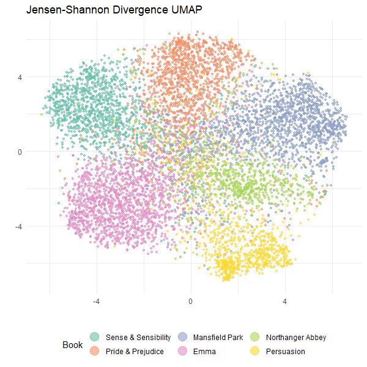

```{r, include = FALSE}
knitr::opts_chunk$set(
  collapse = TRUE,
  comment = "#>",
  eval = FALSE
)
```

It is a truth universally acknowledged than an article author in possession of a
Jane Austen dataset must be in want of a k-nearest neighbor graph. 

In searching for a good example of working with sparse data, text analysis is
a good fit. Using [TF-IDF](https://en.wikipedia.org/wiki/Tf%E2%80%93idf) on
a corpus of text documents naturally creates long sparse vectors. We shall use
[janeaustenr](https://cran.r-project.org/package=janeaustenr) which you can see
used for TF-IDF in this
[tidytext vignette](https://cran.r-project.org/web/packages/tidytext/vignettes/tf_idf.html).
However due to my lack of experience with tidy data principles, I will be using
[tm](https://cran.r-project.org/package=tm) and
[slam](https://cran.r-project.org/package=slam) to create the TF-IDF matrix.

This article was inspired by a [similar example in Python](https://umap-learn.readthedocs.io/en/latest/sparse.html#a-text-analysis-example).

## This is not a Vignette

 As we need to install and load a lot of packages this is *not*
a vignette and I won't show all the output unless it's interesting or relevant
to the task at hand, but you should get similar results if you install the
packages and run all the code.

## Setup

Let's install some packages:

```{r install}
install.packages(c(
  "tm",
  "slam",
  "janeaustenr",
  "dplyr",
  "uwot",
  "Matrix",
  "RSpectra",
  "RColorBrewer",
  "ggplot2"
))
```

And then load them:

```{r load-packages}
library(tm)
library(slam)
library(janeaustenr)
library(dplyr)
library(rnndescent)
library(uwot)
library(Matrix)
library(RSpectra)
library(RColorBrewer)
library(ggplot2)
```

## Preprocessing the Text Data

Let's start by getting the data. The `austen_books()` function returns a tibble
with the text of all of Jane Austen's six novels, with about 70 characters worth
of text per row.

```{r load data}
data <- austen_books()
dim(data)
```
```
[1] 73422     2
```

There is a `book` factor column that tells us what book each line of text is
from and then the `text` contains the text itself.

```{r head data}
head(data, 10)
```
```
# A tibble: 10 × 2
   text                    book               
   <chr>                   <fct>              
 1 "SENSE AND SENSIBILITY" Sense & Sensibility
 2 ""                      Sense & Sensibility
 3 "by Jane Austen"        Sense & Sensibility
 4 ""                      Sense & Sensibility
 5 "(1811)"                Sense & Sensibility
 6 ""                      Sense & Sensibility
 7 ""                      Sense & Sensibility
 8 ""                      Sense & Sensibility
 9 ""                      Sense & Sensibility
10 "CHAPTER 1"             Sense & Sensibility
```

Ok, that's not a lot of text in those rows and a lot of pre-amble. Let's take
a look at the end (spoiler alerts for the end of Persuasion):

```{r tail data}
tail(data, 10)
```
```
# A tibble: 10 × 2
   text                                                                      book      
   <chr>                                                                     <fct>     
 1 "affection.  His profession was all that could ever make her friends"     Persuasion
 2 "wish that tenderness less, the dread of a future war all that could dim" Persuasion
 3 "her sunshine.  She gloried in being a sailor's wife, but she must pay"   Persuasion
 4 "the tax of quick alarm for belonging to that profession which is, if"    Persuasion
 5 "possible, more distinguished in its domestic virtues than in its"        Persuasion
 6 "national importance."                                                    Persuasion
 7 ""                                                                        Persuasion
 8 ""                                                                        Persuasion
 9 ""                                                                        Persuasion
10 "Finis"                                                                   Persuasion
```

Alright, so we can expect a lot of blank rows. I'd like a bit more text per
entry (and also this reduces the number of rows we need to process during
neighbor search). Let's group the rows into chunks of 10 and then collapse them.
If you want to experiment with this, then you can change the `n_chunks` value
below.

```{r process data}
n_chunks <- 10
data_processed <- data |>
  group_by(`book`) |>
  mutate(`row_group` = ceiling(row_number() / n_chunks)) |>
  group_by(`book`, `row_group`) |>
  summarise(text = paste(`text`, collapse = " ")) |>
  ungroup()
dim(data_processed)
```
```
[1] 7344    3
```

```{r head processed}
head(data_processed)
```
```
# A tibble: 6 × 3
  book                row_group text                                                                                                                              
  <fct>                   <dbl> <chr>                                                                                                                             
1 Sense & Sensibility         1 "SENSE AND SENSIBILITY  by Jane Austen  (1811)     CHAPTER 1"                                                                     
2 Sense & Sensibility         2 "  The family of Dashwood had long been settled in Sussex.  Their estate was large, and their residence was at Norland Park, in t…
3 Sense & Sensibility         3 "alteration in his home; for to supply her loss, he invited and received into his house the family of his nephew Mr. Henry Dashwo…
4 Sense & Sensibility         4 " By a former marriage, Mr. Henry Dashwood had one son: by his present lady, three daughters.  The son, a steady respectable youn…
5 Sense & Sensibility         5 "father only seven thousand pounds in his own disposal; for the remaining moiety of his first wife's fortune was also secured to …
6 Sense & Sensibility         6 "son's son, a child of four years old, it was secured, in such a way, as to leave to himself no power of providing for those who …
```

## Text Analysis

Next, we must make some decisions about the text pre-processing. You shouldn't
take any of my decisions as some gold standard of how to do text processing. The
good news is that you can experiment with different approaches and visualizing
the results with UMAP should provide some feedback.


```{r create corpus}
corpus <-
  Corpus(VectorSource(data_processed$text)) |>
  tm_map(content_transformer(tolower)) |>
  tm_map(removePunctuation) |>
  tm_map(removeNumbers) |>
  tm_map(removeWords, stopwords("english")) |>
  tm_map(stripWhitespace)
```

Now we can create the TF-IDF matrix:

```{r create TfIdf}
tfidf <- weightTfIdf(DocumentTermMatrix(corpus))
dim(tfidf)
```
```
[1]  7344 18853
```

So nearly 20,000 columns. That's a lot of dimensions. For a lot of downstream
analysis with dimensionality reduction a typical workflow would involve:

* Potentially converting this to a dense representation. As we only have 7,000
rows this is not a huge memory burden. But if you decided to use the original
data, you would now have a matrix 10 times the size.
* Do some linear dimensionality reduction to a more dense representation, e.g.
Truncated SVD to a few hundred (at most) dimensions. Or maybe a random
projection? In a lot of these cases, there are ways to do this with the sparse
input so you wouldn't necessarily need to densify the initial matrix.
  
Nonetheless, this involves making a decision about the number of dimensions to
keep, you need to track what sort of information loss is involved with that
decision, spend the time to do the dimensionality reduction, and then it's more
data to keep track of. This is where `rnndescent` helps by being able to
generate the neighbor graph from the sparse representation directly.

## Some More Preprocessing

Just before we go only further, `rnndescent` only works with `dgCMatrix` so
we need to convert the tf-idf matrix:

```{r create sparse matrix}
tfidf_sp <-
  sparseMatrix(
    i = tfidf$i,
    j = tfidf$j,
    x = tfidf$v,
    dims = dim(tfidf)
  )
```

And we should normalize the rows. Sadly, `apply` doesn't work well with sparse
matrices, so we have to be a bit more creative. An L2 normalization looks like:

```{r L2 normalize}
tfidf_spl2 <-
  Diagonal(x = 1 / sqrt(rowSums(tfidf_sp^2))) %*% tfidf_sp
```

I'm going to use a divergence-based distance metric which assumes that each
row is a probability distribution so I will do an L1 normalization 
which requires even more creativity. [This gist by privefl](https://gist.github.com/privefl/1895694804bf9c91a28dd85d3ebf953d) was
my guide here:

```{r L1 normalize}
l1_normalize <- function(X) {
  res <- rep(0, nrow(X))
  dgt <- as(X, "TsparseMatrix")
  tmp <- tapply(dgt@x, dgt@i, function(x) {
    sum(abs(x))
  })
  res[as.integer(names(tmp)) + 1] <- tmp
  Diagonal(x = 1 / res) %*% X
}
tfidf_spl1 <- l1_normalize(tfidf_sp)
head(rowSums(tfidf_spl1))
```
```
[1] 1 1 1 1 1 1
```

## Nearest Neighbor Search

With only 7000 rows, we can do a brute force search and get the exact nearest
neighbors.

```{r brute force search}
tfidfl1_js_bf <-
  brute_force_knn(
    tfidf_spl1,
    k = 15,
    metric = "jensenshannon",
    n_threads = 6,
    verbose = TRUE
  )
```
```
10:19:28 Calculating brute force k-nearest neighbors with k = 15 using 6 threads
0%   10   20   30   40   50   60   70   80   90   100%
[----|----|----|----|----|----|----|----|----|----]
***************************************************
10:20:52 Finished
```

This only takes just over a minute with 6 threads on my 8th-gen Intel i7 laptop
which is no longer cutting-edge.

## Hubness

I always strongly recommend looking at the distribution of the edges throughout
the graph, and specifically looking at the hubness. First generate the
k-occurrences:

```{r k occurrences}
k_occurrences <- k_occur(tfidfl1_js_bf)
summary(k_occurrences)
```
```
   Min. 1st Qu.  Median    Mean 3rd Qu.    Max. 
      1       6      11      15      19     167 
```

This is telling us about the popularity of items in the dataset, i.e. while
every item has 15 neighbors, which items tend to show up in the neighbor list
of items more than average? If an item has a k-occurrence higher than 15 then
it's more popular than average, and vice versa. An item with a k-occurrence
of 1 is called an anti-hub, and is an item that is never a neighbor of any
other item (the one edge it has is to itself). Conversely, we can see that
some items are *very* popular, with a k-occurrence more than ten times higher 
than average. These could definitely be considered hubs.

Here's the k-occurrences of the top 6 most popular items:

```{r hubs}
tail(sort(k_occurrences))
```
```
[1] 129 137 138 152 158 167
```

And here is how many anti-hubs we have:

```{r anti-hubs}
sum(k_occurrences == 1)
```
```
[1] 129
```

So 129 pieces of text in the corpus are not considered to be in the top-15
neighbors of any other piece of text. Not quite 2% of the dataset.

Note that the values you get for hubness are *highly* dependent on things like
how the dataset is scaled, what distance you use and obviously the number of
neighbors. In this case, we're doing pretty ok. Using the Euclidean distance on
high-dimensional data tends to produce very large numbers of hubs, which can 
really distort the downstream analysis so it's important to check this.

## Hub and Hubbability

Perhaps we can learn something about the dataset by taking a closer look at
the hubs and anti-hubs. The hubs represent items which are seen as similar by
lots of other items, so you could imagine that these items represent the
most Jane Austen-like pieces of text in the dataset. Meanwhile the anti-hubs
must be less usual prose in some way. Let's look at the popular text first.

### Popular Text

```{r popular text}
popular_indices <- head(order(k_occurrences, decreasing = TRUE))
data_processed[popular_indices, c("book", "text")]
```
```
# A tibble: 6 × 2
  book              text                                                                                          
  <fct>             <chr>                                                                                         
1 Mansfield Park    "You will be what you ought to be to her. I hope it does not distress you very much, Fanny?\"…
2 Emma              "know any body was coming. 'It is only Mrs. Cole,' said I, 'depend upon it. Nobody else would…
3 Pride & Prejudice "Jane? Shall you like to have such a brother?\"  \"Very, very much. Nothing could give either…
4 Emma              " \"Perhaps she might; but it is not every man's fate to marry the woman who loves him best. …
5 Northanger Abbey  " \"Henry!\" she replied with a smile. \"Yes, he does dance very well.\"  \"He must have thou…
6 Pride & Prejudice " \"I wish you joy. If you love Mr. Darcy half as well as I do my dear Wickham, you must be v…
```

Here's the full text from the most popular item:

```{r most popular text}
data_processed[popular_indices[1], ]$text
```
```
[1] "You will be what you ought to be to her. I hope it does not distress you very much, Fanny?\"  \"Indeed it does: I cannot like it. I love this house and everything in it: I shall love nothing there. You know how uncomfortable I feel with her.\"  \"I can say nothing for her manner to you as a child; but it was the same with us all, or nearly so. She never knew how to be pleasant to children. But you are now of an age to be treated better; I think she is"
```

All dialog and it does contain the word "love" in a lot of them. But without
looking at other text, it's hard to say if that is a distinguishing
characteristic of this text. So let's now look at the unpopular items.

### Unpopular Text

In terms of the anti-hubs, we have a large number of those, so let's sample 6
at random:

```{r unpopular text}
unpopular_indices <- which(k_occurrences == 1)
data_processed[sample(unpopular_indices, 6), c("book", "text")]
```
```
# A tibble: 6 × 2
  book                text                                                                                                                                  
  <fct>               <chr>                                                                                                                                 
1 Emma                "a letter, among the thousands that are constantly passing about the kingdom, is even carried wrong--and not one in a million, I supp…
2 Northanger Abbey    "Catherine heard neither the particulars nor the result. Her companion's discourse now sunk from its hitherto animated pitch to nothi…
3 Mansfield Park      "whose distress she thought of most. Julia's elopement could affect her comparatively but little; she was amazed and shocked; but it …
4 Persuasion          "tried, more fixed in a knowledge of each other's character, truth, and attachment; more equal to act, more justified in acting.  And…
5 Sense & Sensibility "but not on picturesque principles.  I do not like crooked, twisted, blasted trees.  I admire them much more if they are tall, straig…
6 Sense & Sensibility "and though a sigh sometimes escaped her, it never passed away without the atonement of a smile.  After dinner she would try her pian…
```

And here's the full text of a randomly selected item:
```
data_processed[sample(unpopular_indices, 1),]$text
```
```
[1] "unwelcome, most ill-timed, most appalling! Mr. Yates might consider it only as a vexatious interruption for the evening, and Mr. Rushworth might imagine it a blessing; but every other heart was sinking under some degree of self-condemnation or undefined alarm, every other heart was suggesting, \"What will become of us? what is to be done now?\" It was a terrible pause; and terrible to every ear were the corroborating sounds of opening doors and passing footsteps.  Julia was the first to move and speak again. Jealousy and bitterness had been suspended: selfishness was lost in the common cause; but at the"
```

There's definitely a different flavor to the text of the anti-hubs we see here
compared to the hubs, but this is only a small fraction of the anti-hubs. At
least it isn't just pulling out passages from Northanger Abbey.

### Popular and Unpopular Words

It's not entirely obvious what the difference is between the popular and
unpopular texts. Maybe we can look at the average tf-idf value of the words in
the most and least popular texts? To check this makes any sense at all, let's
just see what the most popular words in Pride & Prejudice are with this method:

```{r popular Pride & Prejudice words}
pap <- tfidf_sp[data_processed$book == "Pride & Prejudice", ]
mean_pap <- colMeans(pap)
names(mean_pap) <- colnames(tfidf)
mean_pap[mean_pap > 0] |>
  sort(decreasing = TRUE) |>
  head(10)
```
```
elizabeth      darcy     bennet    bingley       jane       will       said    wickham    collins      lydia 
0.04253865 0.03290232 0.02795931 0.02545364 0.01991761 0.01847970 0.01713893 0.01687501 0.01687119 0.01438015 
```

That actually correponds ok with results from the `tidytext` vignette: it's mainly
character names (and, er, `'said'`).

If we apply this to the dataset as a whole:

```{r dataset words}
mean_tfidf <- colMeans(tfidf_sp)
names(mean_tfidf) <- colnames(tfidf)
mean_tfidf[mean_tfidf > 0] |>
  sort(decreasing = TRUE) |>
  head(10)
```
```
      will        mrs       said       must       miss       much        one      think       know      never 
0.01630534 0.01513324 0.01446493 0.01388111 0.01355313 0.01307697 0.01266730 0.01200490 0.01169455 0.01152472
```

Now we have more generic words, although `said` is still there. Way to go, 
`said`.

What do the popular words look like (and is `said` in there too?):

```{r popular words}
mean_popular_tfidf <- colMeans(tfidf_sp[popular_indices, ])
names(mean_popular_tfidf) <- colnames(tfidf)
mean_popular_tfidf[mean_popular_tfidf > 0] %>%
  sort(decreasing = TRUE) %>%
  head(10)
```
```
      love      quite       well       feel      think       like      shall       sure    nothing        yes 
0.08188918 0.07007464 0.06825873 0.06808318 0.06540969 0.06223084 0.06055058 0.05710714 0.05624428 0.05375587 
```

There's `love` right at the top. No `said` to be seen, and not a lot of overlap
with the average words.

Onto the unpopular text.

```{r unpopular words}
mean_unpopular_tfidf <- colMeans(tfidf_sp[unpopular_indices, ])
names(mean_unpopular_tfidf) <- colnames(tfidf)
mean_unpopular_tfidf[mean_unpopular_tfidf > 0] |>
  sort(decreasing = TRUE) |>
  head(10)
```
```
      every        much        mind       might        must     harriet     without         one        long       first 
0.014918830 0.011596126 0.011479893 0.011270905 0.011188771 0.010718795 0.010047623 0.009764715 0.009650010 0.009499682 
```

There is a bit more overlap with the average words here, but what was it Tolstoy
said about unhappy families? I wouldn't necessarily expect a theme to emerge
from chunks of text which have nothing in common with anything else.

So there you have scientific proof that if you want to sound like Jane Austen,
write about "love". "think" and "feel". If you *don't* want to sound like
classic Jane Austen, sprinkle in an "every" and a "long". Also "Harriet". Good
luck.

## UMAP

We can also visualize the neighbor graph by carrying out dimensionality 
reduction using UMAP via the `uwot` package. This will attempt place nearest
neighbors close together in a 2D scatter plot.

`uwot`doesn't need any more input information than the k-nearest neighbor graph, 
which you pass to the `nn_method` parameter. This also requires explicitly
setting the usual data input parameter `X` to `NULL`. I am also setting the
density scaling to `0.5`, which attempts to re-add some of the relative density
of any clusters in the data back into the embedding using the 
[LEOPOLD approximation to densMAP](https://jlmelville.github.io/uwot/leopold.html).

UMAP uses a random number generator as part of its contrastive learning style
optimization, but I am purposely *not* setting a random seed so that you will
get different results from me. This is a way to avoid over-interpreting the
layout of the clusters. I recommend running the algorithm a few times and seeing
what changes.

```{r umap}
js_umap <-
  umap(
    X = NULL,
    nn_method = tfidfl1_js_bf,
    n_sgd_threads = 6,
    n_epochs = 1000,
    batch = TRUE,
    init_sdev = "range",
    dens_scale = 0.5,
    verbose = TRUE
  )
```

## Plot

Let's plot what we got:

```{r plot umap}
ggplot(
  data.frame(js_umap, Book = data_processed$book),
  aes(x = X1, y = X2, color = Book)
) +
  geom_point(alpha = 0.6, size = 1) +
  scale_color_brewer(palette = "Set2") +
  theme_minimal() +
  labs(
    title = "Jensen-Shannon Divergence UMAP",
    x = "",
    y = "",
    color = "Book"
  ) +
  theme(legend.position = "bottom") +
  guides(color = guide_legend(override.aes = list(size = 5)))
```



Hey, that looks pretty good! We can see that the texts from each book are mostly
clustered together. The clusters for "Persuasion" and "Northanger Abbey" are
smaller than the other books. In terms of the relative position of the clusters,
you must take care not to over-interpret this. When I re-run UMAP multiple times
the clusters do move about, but "Pride & Prejudice" and "Sense & Sensibility"
usually end up together. 

### Neighbor Preservation

To get a more quantitative sense of how well this reduction has preserved
the high-dimensional structure, we can calculate the nearest neighbors in the
2D space and compare them to the nearest neighbors in the high-dimensional
space. 

With only two dimensions, brute force search is very fast. UMAP uses the 
*Euclidean* distance in the output embedding to match the similarities in the
input space, so we use `metric = "euclidean"` rather than `"jensenshannon"`:

```{r 2D neighbors}
umap_nbrs <-
  brute_force_knn(js_umap,
    k = 15,
    n_threads = 6,
    metric = "euclidean"
  )
```

Now we can measure the overlap between the two neighbor graphs:

```{r overlap}
neighbor_overlap(umap_nbrs, tfidfl1_js_bf)
```
```
0.1604303
```

So on average 16% of the neighbor list was retained after embedding into 2D.
Although this doesn't sound like much, this actually pretty standard for UMAP
(and maybe a bit better than normal). Your numbers are going to vary a bit from
this, but hopefully not by much.

## Conclusion

Whatever you think of my text analysis skills, the point is that `rnndescent`
can be used to handle sparse data as easily as dense data, which makes working
with it a lot simpler.
